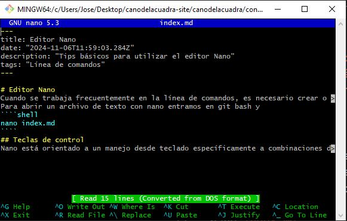

Cuando trabajamos en servidores, configurando entornos Linux o desarrollando en la nube, manejar el editor  Nano o Vi puede ser beneficioso

## Cundo usar el  Editor Nano
Cuando se trabaja frecuentemente en la línea de comandos, es necesario crear o editar archivos de texto.
Para abrir un archivo de texto con nano entramos en git bash y 
````shell
nano index.md
````
## Teclas de control
Nano está orientado a un manejo desde teclado específicamente a combinaciones de la tecla Control. 

Por ejemplo, Control-O guarda el archivo actual y Control-W abre el menú de búsqueda. La barra de accesos directos de nano tiene dos filas colocadas en la parte baja de la pantalla, que lista algunos de los comandos disponibles en función del contexto. Para ver una lista completa basta con presionar Control-G y se obtiene una pantalla de ayuda.